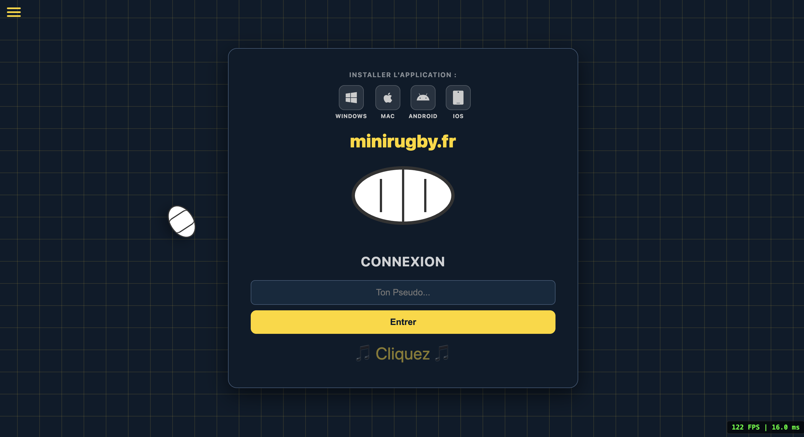
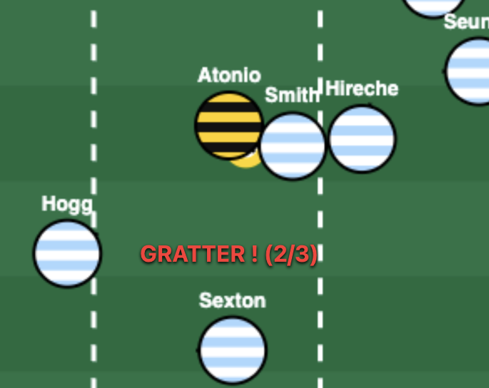
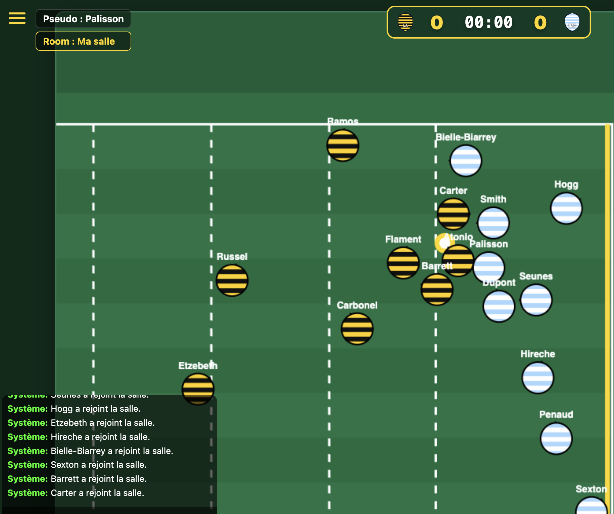
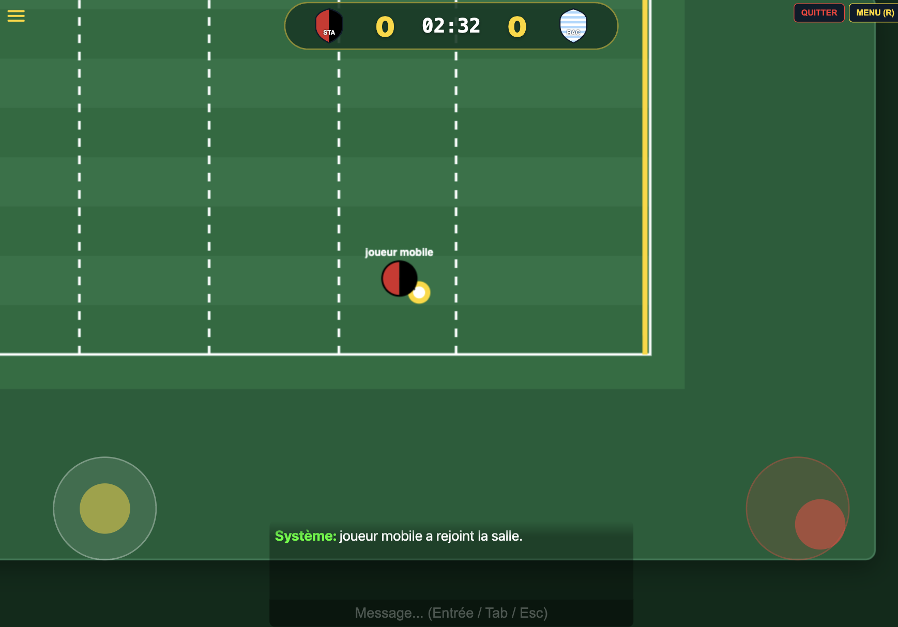
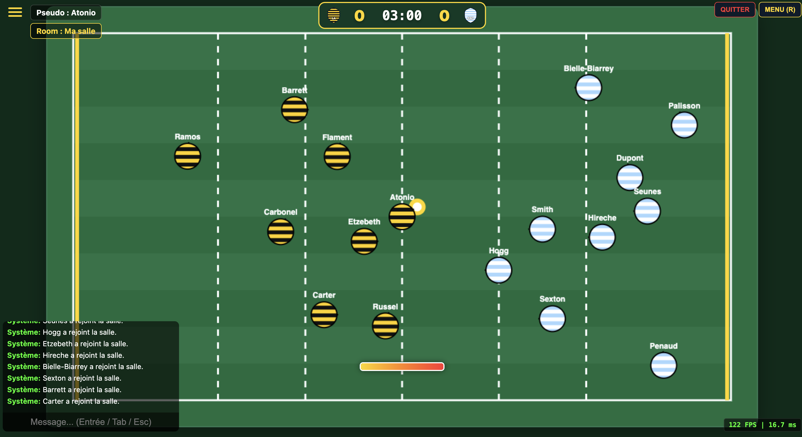
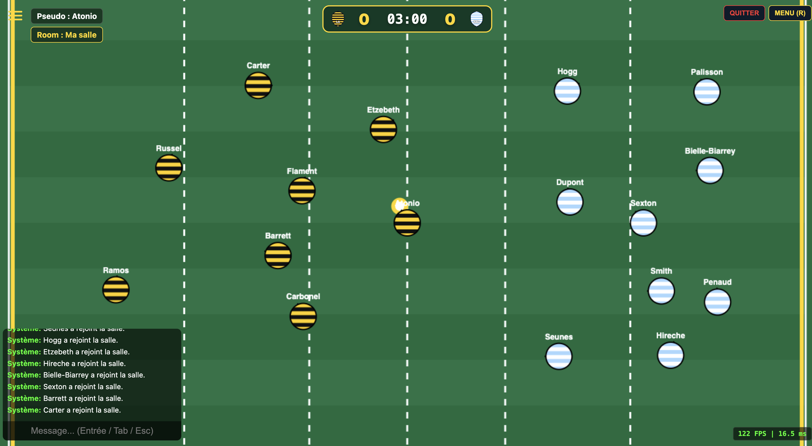
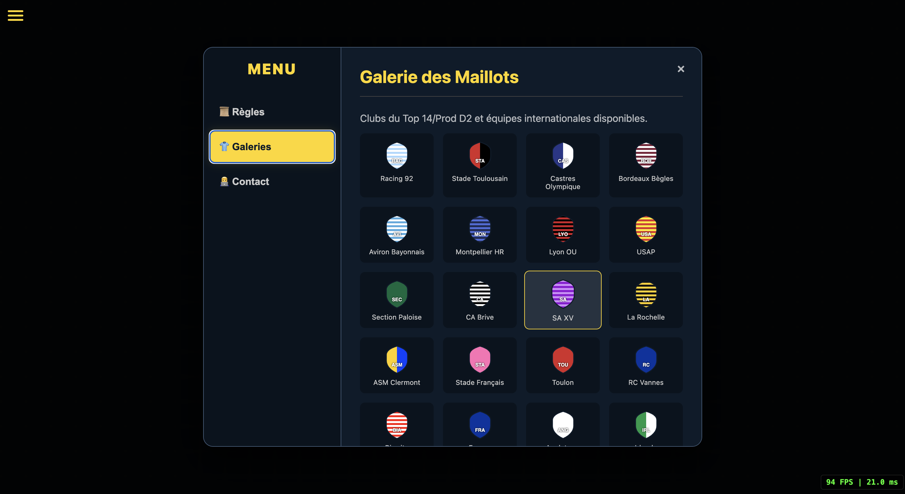
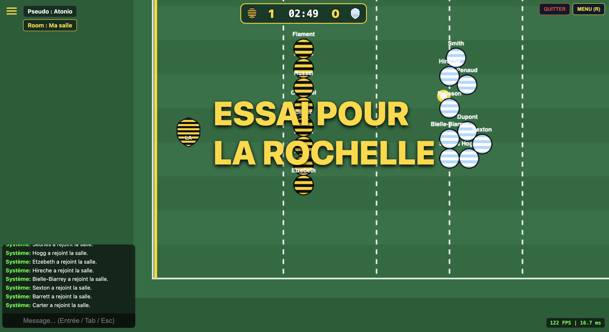

# 🏉 MiniRugby.fr

> **Jouer maintenant :** [https://minirugby.fr](https://minirugby.fr)

---

## 👋 À propos du projet

**MiniRugby.fr** est un jeu multijoueur en temps réel développé entièrement en JavaScript.

L'objectif était de créer une expérience **rapide, arcade et compétitive** inspirée de jeux comme *Haxball*, mais adaptée aux règles et à la physique du rugby (passes en arrière, grattage, essais).

⚠️ **Note :** *Ce dépôt ne contient pas le code source complet du jeu pour des raisons de protection/sécurité. Il sert de documentation technique, de portfolio et d'explication des mécanismes.*

---

## 🛠️ Technique

* **Backend :** Node.js
* **Netcode :** Socket.io (WebSockets pour la communication bidirectionnelle temps réel)
* **Frontend :** HTML5 Canvas API (pour dessiner le jeu à 60 FPS)
* **Serveur :** VPS (Scaleway) sous Ubuntu
* **Sécurité & Proxy :** Nginx

---

## 🧠 Architecture Client-Serveur

Si on laisse le client décider de sa position, la triche est trop facile. J'ai donc opté pour une architecture **Autoritaire Serveur**.

1.  **Le Serveur est Dieu :** Toute la physique (collisions, position de la balle, scores) est calculée côté serveur dans une boucle de jeu stricte (60 ticks/seconde).
2.  **Le Client est un écran :** Le navigateur envoie les "Inputs" (touches appuyées) au serveur.
3.  **Réconciliation :** Le serveur renvoie l'état du monde (`gameState`).
4.  **Interpolation :** Le client lisse les mouvements pour compenser la latence et éviter les saccades visuelles.

---

## 🧮 Mathématiques & Algorithmes

### 1. Lissage Réseau : Interpolation Linéaire (Lerp)

Le serveur envoie la position des joueurs 60 fois par seconde, mais l'écran du joueur peut rafraîchir à 144Hz. De plus, la latence internet (ping) peut est instable. Si on affichait bêtement les coordonnées reçues, le joueur se téléporterait par saccades.

J'utilise une fonction mathématique d'**Interpolation Linéaire (Lerp)** pour lisser le mouvement entre la position actuelle ($P_{actuelle}$) et la nouvelle position reçue du serveur ($P_{cible}$).

La formule utilisée à chaque frame de rendu est :

$$P_{nouveau} = P_{actuelle} + (P_{cible} - P_{actuelle}) \times t$$

* Où $t$ est le facteur de lissage (entre 0 et 1).
* J'utilise une variante avancée indépendante du framerate (Time-Independent Damping) : `1 - Math.exp(-speed * dt)`, garantissant que la fluidité est identique sur un iPhone à 60Hz et un PC Gamer à 144Hz.

### 2. Contrôles & Visée (Atan2)

Pour gérer les joysticks tactiles et la visée à la souris, je dois constamment convertir des coordonnées cartésiennes $(x, y)$ en coordonnées polaires (Angle et Distance).

La fonction clé est l'Arc Tangente à 2 arguments ($\text{atan2}$), qui permet de trouver l'angle de visée exact en radians :

$$\theta = \text{atan2}(y_{curseur} - y_{joueur}, x_{curseur} - x_{joueur})$$

Cet angle $\theta$ est ensuite utilisé pour :
1.  Orienter le regard du joueur (rotation du sprite).
2.  Définir le vecteur de direction de la passe lors du tir via $\cos(\theta)$ et $\sin(\theta)$.

### 3. Le Grattage

C'est la mécanique défensive principale. Comment coder le fait qu'un joueur doit être "face" à l'adversaire pour lui voler la balle ? Pour détecter mathématiquement si le défenseur est "face" à l'attaquant, j'utilise le **Produit Scalaire** des vecteurs de direction.

* $\vec{A}$ : Vecteur regard du défenseur.
* $\vec{B}$ : Vecteur reliant le défenseur à l'attaquant.

La formule de vérification est :

$$\text{P} = (\vec{A}_x \cdot \vec{B}_x) + (\vec{A}_y \cdot \vec{B}_y)$$

* Si $\text{P} > 0$ : Le défenseur regarde vers l'attaquant → **Grattage autorisé**.
* Si $\text{P} < 0$ : Le défenseur est dos à l'attaquant → **Grattage refusé**.

  

Le code vérifie deux choses :
1.  **Distance :** Le défenseur est-il à moins de X pixels du porteur ?
2.  **Angle :** Le défenseur regarde-t-il vers le porteur ? (Produit scalaire positif).

  

<em>Dans cette situation, le joueur bleu ne peut pas gratter le ballon car il tourne le dos au porteur (Dot < 0).</em>

### 4. Collisions

Pour que les joueurs ne se traversent pas et pour gérer le contact physique, je dois détecter les collisions entre des cercles (les joueurs) et le ballon.

J'utilise la **distance euclidienne**.

$$D = \sqrt{(x_2 - x_1)^2 + (y_2 - y_1)^2}$$

Si la distance $D$ est inférieure à la somme des rayons des deux entités, une collision physique intervient.

---

## ⚡ Mécanique de Passe

La passe dépend de la position de la souris (ou du joystick droit) et d'une charge de puissance.

* **Calcul :** On trace un vecteur directeur entre le joueur et le curseur.
* **Logique :** On normalise ce vecteur et on le multiplie par la charge de puissance accumulée. Cette vélocité est appliquée à la balle au relâchement de la touche.

---

## 📱 Challenge Mobile & UX

Rendre un jeu compétitif clavier/souris jouable sur téléphone était un gros morceau.

* **Dual Stick Virtuel :** J'ai codé mon propre système de joysticks tactiles.
    * *Gauche :* Déplacement.
    * *Droit :* Visée + Tir (avec une logique dynamique : le centre du joystick se place là où l'utilisateur pose son doigt).
* **Responsive :** Le jeu force l'affichage paysage et recalcule le zoom du terrain (canvas scale) dynamiquement pour qu'il prenne 100% de l'écran, peu importe la taille du téléphone.
* **PWA :** Le jeu est installable comme une app native (fichier `manifest.json` et Service Workers).

  

---

## 📐 Adaptabilité & Scaling du Terrain

Un terrain parfait pour du 1v1 peut devenir injouable et chaotique en 10v10.

J'ai implémenté un système de **redimensionnement dynamique côté serveur**. L'administrateur de la salle peut changer la taille du terrain à la volée. Le serveur recalcule alors les limites et renvoie les nouvelles dimensions à tous les clients.

<table>
  <tr>
    <td align="center" width="50%">
      
       
      <em>Terrain Moyen : Idéal pour du 3 contre 3</em>
    </td>
    <td align="center" width="50%">
      
       
      <em>Grand Terrain : Optimisé pour du 7 contre 7 ou 15 contre 15</em>
    </td>
  </tr>
</table>

---

## 🔒 Sécurité & Déploiement

Pour passer d'un "projet local" à un jeu en production :

* **Obfuscation :** Le code client (`game.min.js`) est obfusqué et minifié pour empêcher le vol de code et la triche simple.
* **HSTS & CSP :** Configuration Nginx stricte pour obtenir un score de sécurité B+ sur Mozilla Observatory (protection XSS, iframes interdites, etc.).

---

## 🚀 Fonctionnalités

✅ **Salles Publiques :** Création et liste des serveurs en temps réel.

✅ **Galerie de Maillots :** Utilisation de SVG optimisés pour afficher les maillots Top 14/Prod D2 et Internationaux sans perte de qualité.

  

✅ **Chat In-Game :** Avec bulles de discussion au-dessus des joueurs.

✅ **Mode Spectateur :** Possibilité de regarder un match sans jouer.

✅ **Célébrations :** Animation lors d'une victoire ou d'un essai.

  

---

Merci d'avoir pris le temps de lire cette documentation technique ! 
Le meilleur moyen de voir ces concepts en action -> rendez-vous sur **[minirugby.fr](https://minirugby.fr)**.

**Auteur :** Arnaud Grassian
